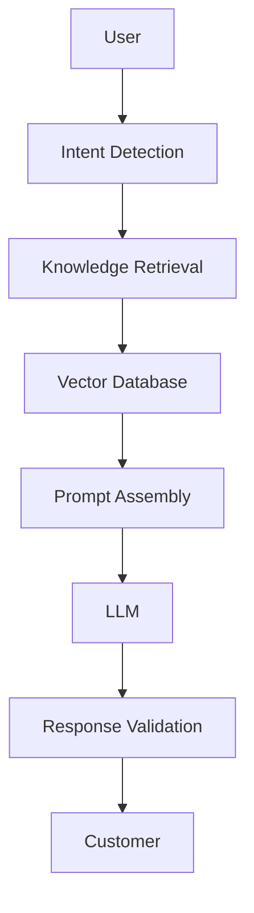

# AI Processing Pipeline

```mermaid
flowchart TD
    A[User] --> B[Intent Detection]
    B --> C[Knowledge Retrieval]
    C --> D[Vector Database]
    D --> E[Prompt Assembly]
    E --> F[LLM]
    F --> G[Response Validation]
    G --> H[Customer]
```