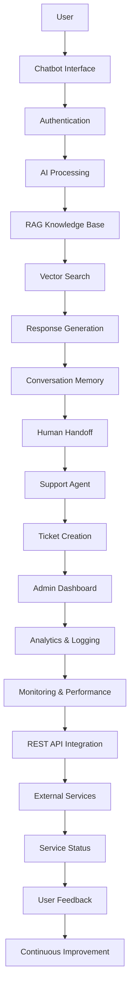

```mermaid
flowchart TD
A[User] --> B[Chatbot Interface]
B --> C[Authentication]
C --> D[AI Processing]
D --> E[RAG Knowledge Base]
E --> F[Vector Search]
F --> G[Response Generation]
G --> H[Conversation Memory]
H --> I[Human Handoff]
I --> J[Support Agent]
J --> K[Ticket Creation]
K --> L[Admin Dashboard]
L --> M[Analytics & Logging]
M --> N[Monitoring & Performance]
N --> O[REST API Integration]
O --> P[External Services]
P --> Q[Service Status]
Q --> R[User Feedback]
R --> S[Continuous Improvement]
```