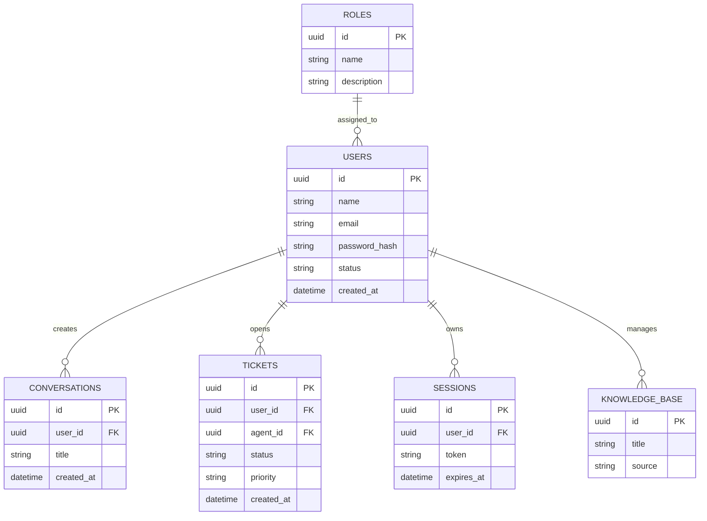

```mermaid
erDiagram

    USERS {
        uuid id PK
        string name
        string email
        string password_hash
        string status
        datetime created_at
    }

    ROLES {
        uuid id PK
        string name
        string description
    }

    SESSIONS {
        uuid id PK
        uuid user_id FK
        string token
        datetime expires_at
    }

    CONVERSATIONS {
        uuid id PK
        uuid user_id FK
        string title
        datetime created_at
    }

    TICKETS {
        uuid id PK
        uuid user_id FK
        uuid agent_id FK
        string status
        string priority
        datetime created_at
    }

    KNOWLEDGE_BASE {
        uuid id PK
        string title
        string source
    }

    USERS ||--o{ CONVERSATIONS : creates
    USERS ||--o{ TICKETS : opens
    USERS ||--o{ SESSIONS : owns
    ROLES ||--o{ USERS : assigned_to
    USERS ||--o{ KNOWLEDGE_BASE : manages
```